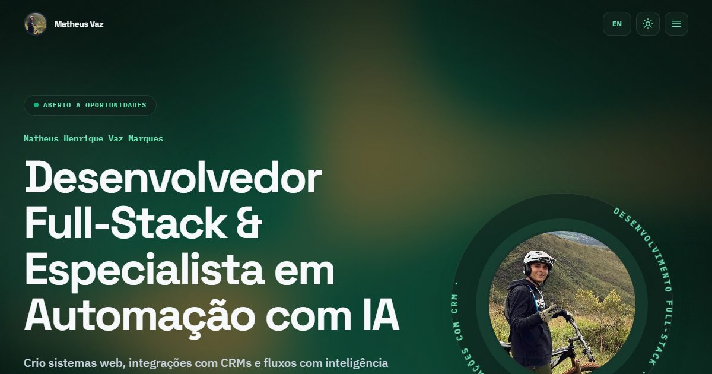

# Portfólio — Matheus Vaz

[](https://portfolio-teuuzims-projects.vercel.app/)


**🔗 [portfolio-teuuzims-projects.vercel.app](https://portfolio-teuuzims-projects.vercel.app/)**

[](https://portfolio-teuuzims-projects.vercel.app/)

Meu portfólio profissional **Matheus Henrique Vaz Marques**, Desenvolvedor Full-Stack e Especialista em Automação com IA. A aplicação apresenta experiência, habilidades, projetos, formação acadêmica e canais de contato em uma interface responsiva e bilíngue.

> **English:** Personal portfolio of Matheus Vaz, Full-Stack Developer & AI Automation Specialist. Built with React, TypeScript, Vite and Tailwind CSS, with scroll-driven motion, a bilingual (PT/EN) interface, light/dark themes and live project previews.

## Projetos em destaque

Além de estudos, o portfólio reúne projetos reais entregues para clientes:

- **[Eco Gold](https://www.ecogoldoficial.com.br)** — site comercial para compra e avaliação de ouro e joias
- **[In and Out Beauty](https://anaclarafilgueiras.com.br)** — site da mentoria de Ana Clara Filgueiras
- **[Casa do Fiat](https://casadofiat.com.br)** — site institucional de peças Fiat, Jeep e RAM
- **[Jota Auto Peças](https://jotaautopecas.com)** — landing page de autopeças multimarcas
- **CRM para Autopeças** — CRM baseado no EspoCRM, com integração ao WhatsApp, usado pelas duas lojas

## Funcionalidades

- Conteúdo em português e inglês, com preferência salva no navegador
- Temas claro e escuro, também persistidos localmente
- Layout responsivo com navegação adaptada para dispositivos móveis
- Animações e transições com respeito à preferência de redução de movimento
- Seções de apresentação, habilidades, experiência, projetos, formação e contato
- Download do currículo em PDF
- Links para demonstrações, repositórios e redes profissionais
- Metadados básicos de SEO e compartilhamento social

## Tecnologias

- [React](https://react.dev/) e [TypeScript](https://www.typescriptlang.org/)
- [Vite](https://vite.dev/)
- [Tailwind CSS](https://tailwindcss.com/)
- [Motion](https://motion.dev/) e [Lenis](https://lenis.darkroom.engineering/) para animações e rolagem suave
- [OGL](https://github.com/oframe/ogl) para o fundo em WebGL do hero

## Pré-requisitos

- [Node.js 22](https://nodejs.org/)
- npm

## Como executar

Clone o repositório e acesse a pasta do projeto:

```bash
git clone https://github.com/Teuuzim/portfolio.git
cd portfolio
```

Instale as dependências e inicie o servidor de desenvolvimento:

```bash
npm ci
npm run dev
```

O Vite exibirá no terminal o endereço local da aplicação, normalmente `http://localhost:5173`.

## Scripts disponíveis

| Comando | Descrição |
| --- | --- |
| `npm run dev` | Inicia o servidor de desenvolvimento com recarregamento automático |
| `npm run build` | Verifica o TypeScript e gera a versão de produção em `dist/` |
| `npm run lint` | Analisa o código com ESLint e não permite avisos |
| `npm run preview` | Serve localmente a versão gerada em `dist/` |

Para testar a versão de produção:

```bash
npm run build
npm run preview
```

## Autor

**Matheus Vaz**

- [GitHub](https://github.com/Teuuzim)
- [LinkedIn](https://linkedin.com/in/matheus-vaz-1a3a2021a)
- [E-mail](mailto:matheusvaz01@yahoo.com.br)
